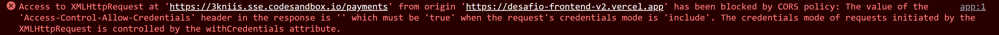

# Desafio Frontend PicPay

Projeto desenvolvido como parte do processo seletivo para a vaga de Desenvolvedor Front-end Angular do PicPay por [Saulo Martins](https://www.linkedin.com/in/saulorodriguesm/)

### Como acessar o dashboard?

A aplicação está disponível em produção no link [Desafio Front-End](https://desafio-frontend-v2.vercel.app)

Conforme solicitado no desafio, a única credencial aceita para acessar o dashboard é:

**Login**: picpay-web
**Senha**: picpay@123

Qualquer outro login não terá permissão para acesso.

**IMPORTANTE**: Devido instabilidade da API, as vezes pode ocorrer do login não ser realizado, sendo exibido um alert com a mensagem de erro na API. Por se tratar de um problema com a API de desenvolvimento, optei por não tratar esse problema pois dificilmente haverão casos como esse em prod.

### Para rodar local

Rode o comando `ng s` e a aplicação será inicializada em `http://localhost:4200/`.

### Para rodar os testes unitários

Rode o comando `ng test` para rodar os testes unitários já existentes na criação de um projeto Angular 2+ com o [Karma](https://karma-runner.github.io).

### Componentes desenvolvidos

##### Tela de Login

Foi desenvolvido a primeira tela que é uma aplicação de autenticação, essa autenticação é realizada consultando o endpoint disponibilizado no [Swagger](https://3kniis.sse.codesandbox.io/) e com isso gerando um token de acesso que é armazenado no localStorage do usuário.

##### Tela do Dashboard

A segunda tela foi desenvolvida utilizando o componente `table` do [Angular Material](https://material.angular.io/), além de botões e ícones oriundos da mesma lib.

##### Session Guard

Optei por desenvolver um guarda de rota simples para garantir que fosse impossível acessar o dashboard sem estar devidamente logado.

##### Dialog/Modal

Para o desenvolvimento do Modal responsável por adicionar novos itens na tabela, optei por utilizar o dialog também do Angular Material citado anteriormente.

### Services desenvolvidos

Optei por desenvolver dois services, um de autenticação que será responsável por realizar a autenticação do usuário e salvar o `access-token` no localStorage e também pelo logout do mesmo.

O segundo service batizado de payments.service.ts será responsável pelo CRUD, tendo como métodos as funções de consulta, atualização, inserção e exclusão.

### Pontos de atenção

Durante o desenvolvimento foi notado um erro de CORS que impediu que a consulta na API fosse realizada com sucesso, dessa maneira impossibilitando o carregamento das informações.

**obs:** Deixo em aberto a possibilidade de ser falha humana por falta de conhecimento ou algo que esqueci durante o desenvolvimento, mas em minhas pesquisas a solução está no lado do backend o qual não possuo acesso.

Por conta do erro acima, não pude desenvolver a páginação e nem o campo de busca solicitados no enunciado do desafio.
